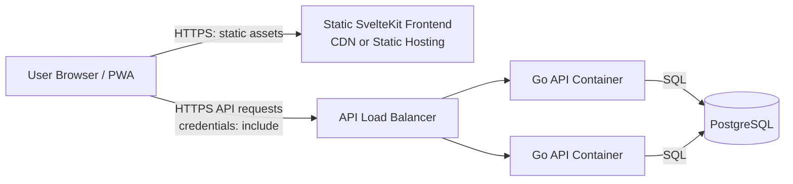

# Settled System Architecture

This document defines the first-release system architecture for Settled. It is an implementation-oriented architecture guide, but it intentionally stays above database schema design, detailed API contracts, and internal module design. Those topics should be handled in follow-up design documents.

## Architecture Goals

Settled should remain lightweight, direct, and easy to operate for a trusted private circle of users. The first release should optimize for correctness, security, simple deployment, and clear boundaries rather than broad extensibility.

Primary goals:

- Keep the frontend and backend independently deployable and independently scalable.
- Keep business rules, authorization, validation, and settlement calculation in the Go backend.
- Keep the SvelteKit frontend focused on rendering, client-side routing, form interaction, and API calls.
- Use PostgreSQL as the primary persistent data store.
- Keep backend instances stateless so they can scale horizontally behind a load balancer.
- Support secure cookie-based authentication even when frontend and backend are deployed on different domains.
- Avoid SSR, service splitting, queues, caches, ORMs, GraphQL, RPC frameworks, and broad client state frameworks in the first release.



## System Context

Settled has four main runtime parts:

- Browser/PWA client: the installed or browser-loaded SvelteKit app.
- Frontend static hosting: serves the built SvelteKit static assets.
- Go API service: owns authentication, authorization, validation, business workflows, and settlement calculation.
- PostgreSQL database: stores users, groups, memberships, expenses, splits, repayments, and other durable application state.

External services are not required for the first release. Email delivery, payment processing, OAuth, mobile shells, desktop shells, queues, caches, and public discovery are outside the current architecture.

## Deployment Topology

The frontend and backend are deployed separately.

```text
User Browser / PWA
        |
        | HTTPS
        v
Static Frontend Hosting / CDN
        |
        | HTTPS API requests with credentials
        v
API Load Balancer
        |
        v
Stateless Go API Containers
        |
        v
PostgreSQL
```

The frontend may be hosted on a different domain from the API. The architecture must therefore not assume shared parent domains, same-site cookies, path-based reverse proxying, or a single combined frontend/backend container.

Expected deployment properties:

- Frontend assets can be scaled through static hosting or CDN behavior.
- Go API containers can be scaled horizontally because authentication state is carried by signed cookies and durable data lives in PostgreSQL.
- PostgreSQL is the system of record and should be treated as the only stateful component in the first release.
- Runtime configuration should be environment-driven so the same container image can run in different environments.

## Frontend Architecture

The frontend is a static SvelteKit/PWA application. The first release should not use SSR.

Responsibilities:

- Render login, registration, group, expense, repayment, and settlement screens.
- Provide client-side routing for app workflows.
- Manage local UI state such as form inputs, loading states, optimistic-disabled controls, and visible errors.
- Call the Go API over HTTPS using credentialed requests.
- Present API validation errors in a clear, user-friendly way.
- Use existing SvelteKit, Tailwind, and shadcn-svelte project conventions.

Non-responsibilities:

- Do not implement business authorization decisions in the frontend as a source of truth.
- Do not calculate final settlement results as authoritative state.
- Do not store bearer tokens in localStorage or sessionStorage.
- Do not introduce SSR solely for authentication or data loading in the first release.
- Do not add a broad client state library unless a later implementation need is explicitly approved.

The frontend may hide or disable controls based on known user role data for usability, but the Go API must enforce every permission check.

## Backend Architecture

The backend is a Go HTTP API using the standard `net/http` package.

Responsibilities:

- Register and authenticate users.
- Issue and validate secure authentication cookies.
- Enforce authorization for all protected workflows.
- Validate all request inputs at the boundary.
- Own group membership and owner permission rules.
- Own expense, split, repayment, and settlement business rules.
- Read and write PostgreSQL data.
- Return consistent JSON responses and status codes.
- Expose operational endpoints needed for container health checks.

Non-responsibilities:

- Do not serve the frontend as the primary production deployment model.
- Do not rely on in-memory process state for authentication, sessions, group data, or settlements.
- Do not introduce a Go web framework, ORM, GraphQL layer, RPC framework, message broker, or background job system for the first release.

Backend instances should be interchangeable. Any instance should be able to handle any authenticated API request as long as it has the configured signing secrets and database access.

## Data Architecture

PostgreSQL is the authoritative data store. The architecture assumes one primary relational database for the first release.

Data principles:

- Store money as integer cents, not floating-point values.
- Use explicit relational constraints where they protect correctness.
- Keep durable records sufficient to recompute group balances from expenses, splits, and repayments.
- Keep authentication-sensitive data, such as password hashes, server-side only.
- Keep schema changes reviewable and migration-friendly once migration tooling is selected.

This document does not define tables, columns, indexes, or migration files. Those belong in the database schema design.

## Authentication And Session Architecture

Authentication uses secure, HTTP-only cookies issued by the Go backend. The frontend does not store or manually attach bearer tokens.

Because frontend and backend may be deployed on different domains, the cookie architecture must support cross-site browser requests:

- Authentication cookies must be `HttpOnly`.
- Production cookies must be `Secure`.
- Cross-site deployments require `SameSite=None`.
- API requests from the frontend must use browser credentials.
- The API must allow credentialed CORS only for configured frontend origins.
- The API must not use wildcard origins for credentialed requests.
- Cookie signing/encryption secrets must come from runtime configuration.
- Cookie expiration and refresh behavior should be explicit in the later API/auth design.

The backend remains the source of truth for the current user. The frontend should derive authenticated state by calling the API, not by decoding or trusting cookie contents.

## CSRF And Browser Security

Cross-site cookies require CSRF protection. The architecture requires CSRF defense for state-changing requests.

Required security posture:

- Validate the `Origin` header for state-changing requests when browsers send it.
- Restrict credentialed CORS to an explicit allowlist of frontend origins.
- Use a CSRF token mechanism for unsafe methods such as `POST`, `PATCH`, and `DELETE`.
- Keep authentication cookies `HttpOnly` so JavaScript cannot read session material.
- Use HTTPS in production for both frontend and backend.
- Set security headers appropriate for an app frontend and JSON API.

The exact CSRF token endpoint, header name, rotation behavior, and middleware placement belong in the API and module design documents.

## Request Flow

Typical authenticated app flow:

1. A user loads the static SvelteKit/PWA frontend.
2. The frontend calls the Go API over HTTPS with credentials enabled.
3. The API validates CORS, CSRF requirements where applicable, and the authentication cookie.
4. The API validates request input and checks group membership or owner permissions.
5. The API executes the business workflow and reads or writes PostgreSQL.
6. The API returns JSON.
7. The frontend renders the resulting state or displays a clear error.

For settlement views, the frontend requests settlement results from the API. The backend computes authoritative pairwise settlement output from persisted expenses, splits, and repayments.

## Authorization Boundary

Authorization is enforced in the Go backend for every protected operation.

System-level authorization rules:

- Unauthenticated users may only access authentication-related endpoints and public health checks.
- Authenticated users may only access groups where they have active membership.
- Owner-only group actions must verify active owner membership.
- Member actions must verify active group membership at the time of the operation.
- Frontend role checks are only presentation hints and must not be trusted.

Detailed permission matrices and endpoint-level behavior belong in the API design.

## Settlement Boundary

Settlement calculation is backend-owned domain logic.

The first release uses pairwise netting:

- Expenses generate debts from participants to payers.
- Repayments reduce debt between members.
- Opposing debts between the same two members are netted to one direction.
- Zero balances are omitted.

The system architecture should preserve a stable settlement response concept so a future minimum-transfer algorithm can replace the internal strategy without changing the frontend's mental model.

This document does not define the Go interface, package layout, or exact response schema. Those belong in module and API design.

## Configuration

Configuration should be supplied through environment variables or equivalent container runtime configuration.

Expected configuration categories:

- HTTP listen address and port.
- Public API origin or base URL.
- Allowed frontend origins for credentialed CORS.
- Cookie domain behavior, secure flag behavior, and environment mode.
- Authentication signing secrets.
- CSRF signing or token secrets, if separate.
- PostgreSQL connection settings.
- Logging level.

Configuration should fail fast at startup when required production values are missing or unsafe.

## Scalability

The first-release scalability model is horizontal scaling of stateless API containers and independent scaling of frontend static delivery.

Allowed first-release scaling moves:

- Increase static hosting/CDN capacity for frontend assets.
- Add Go API replicas behind a load balancer.
- Tune PostgreSQL connection pooling.
- Add database indexes based on measured query needs.
- Increase PostgreSQL capacity as the stateful bottleneck.

Deferred scaling moves:

- Distributed cache.
- Queue or background worker system.
- Service decomposition.
- Read replicas.
- Event-driven architecture.
- Global settlement precomputation.

These deferred moves should require explicit approval because they change the architecture's complexity profile.

## Reliability And Operations

The API should expose lightweight operational endpoints suitable for container platforms.

Operational expectations:

- A liveness check should confirm the process can serve HTTP.
- A readiness check should confirm required dependencies, especially PostgreSQL, are reachable.
- API containers should shut down gracefully on termination signals.
- Database connections should be bounded and reused.
- Logs should be structured enough to diagnose request failures without leaking secrets or password hashes.
- Error responses should be useful to clients without exposing internal details.

Detailed observability tooling is not required for the first release, but the code should avoid choices that make later metrics and tracing difficult.

## PWA And Offline Posture

Settled is PWA-first, but the first release should treat offline behavior conservatively.

The frontend may cache static assets for installability and faster repeat loads. It should not claim that offline edits are durable unless there is a deliberate sync design.

First-release posture:

- Static assets may be cached.
- Authenticated API data should be fetched from the backend as the source of truth.
- Creating expenses, editing expenses, and recording repayments should require network access.
- Any future offline mutation queue requires a separate design because it affects conflict handling and accounting correctness.

## Environment Model

The architecture should support at least local development and production.

Local development may use separate frontend and backend ports. This means local CORS and cookie settings must be configurable without weakening production defaults.

Production must assume:

- HTTPS is available.
- Frontend and backend origins are explicitly configured.
- Authentication cookies are secure.
- Credentialed CORS is origin-restricted.
- Secrets are provided by the runtime environment, not checked into the repository.

## Explicit Non-Goals

The following are not part of the first-release system architecture:

- Server-side rendering.
- Frontend-managed bearer token authentication.
- OAuth, email verification, password reset, or two-factor authentication.
- Payment processing or payment completion verification.
- Public group discovery.
- Tauri or Capacitor shells.
- ORM adoption.
- GraphQL or RPC frameworks.
- Message brokers, queues, or background workers.
- Distributed cache.
- Microservices or service decomposition.
- Database schema design.
- Detailed API endpoint design.
- Go package and module internals.
- Frontend component-level design.

## Follow-Up Design Documents

This architecture should be followed by narrower design documents:

- Database schema design: tables, constraints, indexes, migrations, and deletion strategy.
- API design: routes, request and response shapes, status codes, CORS, cookie, and CSRF details.
- Backend module design: Go package responsibilities, business logic boundaries, store interfaces, and test strategy.
- Frontend application design: route flows, UI state, shadcn-svelte usage, forms, and PWA behavior.

Each follow-up document should preserve the system decisions in this architecture unless a later explicit decision changes them.
